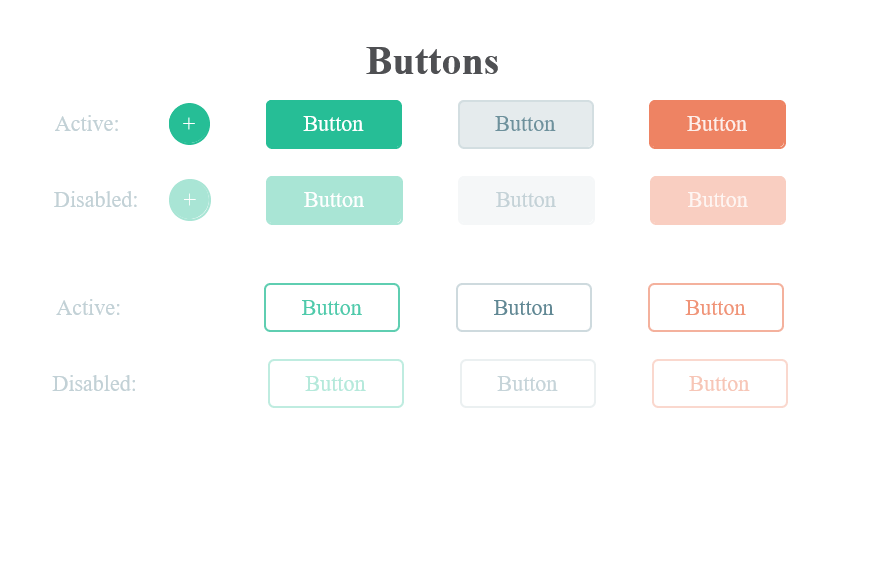
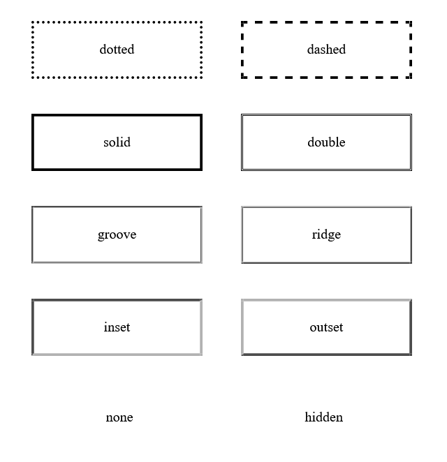

## Lab 2:Buttons,Border,Color and Pseudo class
1. Create buttons as per given figure

2. Create borders as per given figure.

#### Button
-span:The span tag is just like a div, which is used to group similar content so it can all be styled together.

-a tag:The <a> tag defines a hyperlink, which is used to link from one page to another.

-class:The class selector selects HTML elements with a specific class attribute. To select elements with a specific class, write a period (.)

-id:The id selector uses the id attribute of an HTML element to select a specific element.To select elements with a specific id, write a period (#).id should be unique.

-padding:Padding is the space between an element’s border and the element’s content. 

-margin:A margin is the space around an element’s border.

-Pseudo-class:Pseudo-class is a keyword added to a selector that specifies a special state of the selected elements.For example:,:hover,:active.
    -active:The :active CSS pseudo-class represents an element (such as a button) that is being activated by the user.
    -hover:The :hover selector is used to select elements when you mouse over them.

-border:The CSS border properties allow you to specify the style, width, and color of an element's border.The border-style property specifies what kind of border to display.

-background-color:The background-color property sets the background color of an element.

-border-color:The border-color property sets the color of an element's four borders.